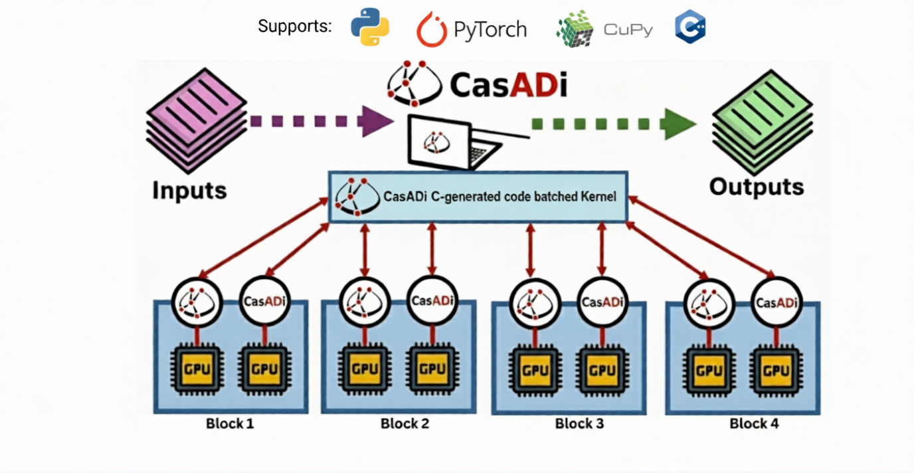

# **casadi on gpu**

<p align="center">
  
</p>

---

This project shows how to take CasADi-generated C code, patch it for CUDA, and evaluate functions directly on the GPU. It also includes a small pybind11-based Python binding archetype so you can call GPU kernels from Python (FK/dynamics are examples to copy/adapt). The demo below evaluates **80k** samples of floating base forward kinematics for a 4 degree of freedom manipulator in under **three milliseconds**. 
<p align="center">
  
</p>

---

A demo of a robot dynamic model with 33 parameters is also included where posteriors of the parameters are sampled from `src/posterior.bin` and batch evaluated for stochastic forward dynamics.

This code is an archetype, not a library: copy/adapt the workflow to your own CasADi functions.

---

## **Workflow Overview**

### **1. Create CasADi function**
Generate your symbolic function in Python/Matlab.

### **2. Generate C code with float as casadi_real**
Use `CodeGenerator(..., {"with_header": True, "casadi_real": "float"})` to emit `.c/.h` into `src/generated/`.

### **3. Patch for CUDA**
- Rename header to `.cuh`, source to `.cu`.
- Add `__device__` to functions that run on GPU.
- Keep math intrinsics as-is; `__device__` mark helper functions used inside device code.

### **4. Add a device wrapper**
Wrap your CasADi entry point to set up `arg`, `res`, `iw`, `w` arrays inside a `__device__` helper, then launch a kernel that calls it per-thread.

### **5. Evaluate many samples in parallel**
Launch a kernel assigning one thread per evaluation and synchronize.

---

## **4. Device Wrapper**

`device_fk_eval.cuh`

```cpp
__device__ void device_fk_eval(
    const casadi_real* q,        // i0[4]
    const casadi_real* params1,  // i1[6]
    const casadi_real* params2,  // i2[6]
    casadi_real* out             // o0[6]
)
{
    const casadi_real* arg_local[3] = { q, params1, params2 };
    const casadi_real** arg = arg_local;

    casadi_real* res_local[1] = { out };
    casadi_real** res = res_local;

    casadi_int  iw[fkeval_SZ_IW > 0 ? fkeval_SZ_IW : 1];
    casadi_real w [fkeval_SZ_W  > 0 ? fkeval_SZ_W  : 1];

    fkeval(arg, res, iw, w, 0);
}
```

### What are `iw`, `w`, and `mem`

CasADi generated functions always follow the signature:

```c
int fun_name(const casadi_real** arg,
           casadi_real** res,
           casadi_int* iw,
           casadi_real* w,
           int mem);
```

`arg` and `res` are arrays of pointers to inputs and outputs
`iw` and `w` are small scratch workspaces CasADi may use internally
The sizes of these arrays are provided in the generated header
For this FK example they are both zero, so we pass small dummy arrays
`mem` is a memory slot index used when CasADi maintains internal state In this FK example it does nothing, so 0 is fine
If your function has non zero workspace sizes, allocate arrays of the required sizes inside the wrapper.

---

## **5. Evaluate Many Samples in Parallel**

This kernel assigns one GPU thread to each FK computation.

```cpp
__global__ void fk_kernel(
    const casadi_real* q_all,    // shape [N, 4]
    const casadi_real* p1,
    const casadi_real* p2,
    casadi_real* out_all,        // shape [N, 6]
    int n_candidates
)
{
    int idx = blockIdx.x * blockDim.x + threadIdx.x;
    if (idx >= n_candidates) return;

    const int DOF = 4;
    const int OUT_DIM = 6;

    const casadi_real* q_i  = q_all   + DOF     * idx;
    casadi_real*       out_i = out_all + OUT_DIM * idx;

    device_fk_eval(q_i, p1, p2, out_i);
}
```

Launch the kernel:

```cpp
fk_kernel<<<blocks, threads>>>(
    d_q_all,
    d_p1,
    d_p2,
    d_out_all,
    N
);

cudaDeviceSynchronize(); // It blocks until every kernel and memory operation is completed
```

Each thread performs one forward kinematics call.
This is what gives the large speedup.

---

## **Project Structure**

```
casadi on gpu/
│
├── src/
│   ├── generated/           CasADi generated & patched CUDA code
│   │   ├── fk_alpha.cu/.cuh
│   │   ├── dynamics_blue.cu/.cuh
│   ├── wrappers/            Device wrappers
│   │   ├── device_fk_wrapper.cuh
│   │   ├── device_dynamics_wrapper.cuh
│   ├── kernels/             Executable entrypoints
│   │   ├── kinematics_main.cu
│   │   ├── dynamics_main.cu
│   ├── posterior.bin        Serialized parameters (posterior samples)
│
└── CMakeLists.txt
```

---

## **Build and Run**

```bash
mkdir build
cd build
cmake ..
make -j8
# Kinematics demo
./run_kinematics_gpu

# Dynamics demo (expects src/posterior.bin)
./run_dynamics_gpu
```

---

## **Python bindings (pybind11)**

This repo also includes a small pybind11 module that exposes the FK and dynamics kernels to Python.
The bindings accept raw GPU pointers (integer addresses) from CuPy or PyTorch tensors.

### Build

```bash
mkdir -p build
cd build
cmake -DBUILD_PYTHON=ON ..
make -j8
```

If CMake cannot find pybind11, point it to your install:

```bash
cmake -DBUILD_PYTHON=ON -Dpybind11_DIR=$(python -m pybind11 --cmakedir) ..
```

### Usage (PyTorch)

```python
import torch
import casadi_on_gpu as cog

N = 1024
q_all = torch.zeros((N, cog.FK_DOF), device="cuda", dtype=torch.float32)
p1 = torch.zeros((6,), device="cuda", dtype=torch.float32)
p2 = torch.zeros((6,), device="cuda", dtype=torch.float32)
out = torch.zeros((N, cog.FK_OUT_DIM), device="cuda", dtype=torch.float32)

stream = torch.cuda.current_stream().cuda_stream
cog.fk_forward(q_all.data_ptr(), p1.data_ptr(), p2.data_ptr(), out.data_ptr(),
               N, stream_ptr=stream, sync=False)
```

### Usage (CuPy)

```python
import cupy as cp
import casadi_on_gpu as cog

N = 1024
q_all = cp.zeros((N, cog.FK_DOF), dtype=cp.float32)
p1 = cp.zeros((6,), dtype=cp.float32)
p2 = cp.zeros((6,), dtype=cp.float32)
out = cp.zeros((N, cog.FK_OUT_DIM), dtype=cp.float32)

stream = cp.cuda.get_current_stream().ptr
cog.fk_forward(q_all.data.ptr, p1.data.ptr, p2.data.ptr, out.data.ptr,
               N, stream_ptr=stream, sync=False)
```

Notes:
- Inputs and outputs must be `float32` on the GPU.
- Use `sync=True` if you are not coordinating with your own CUDA streams.
